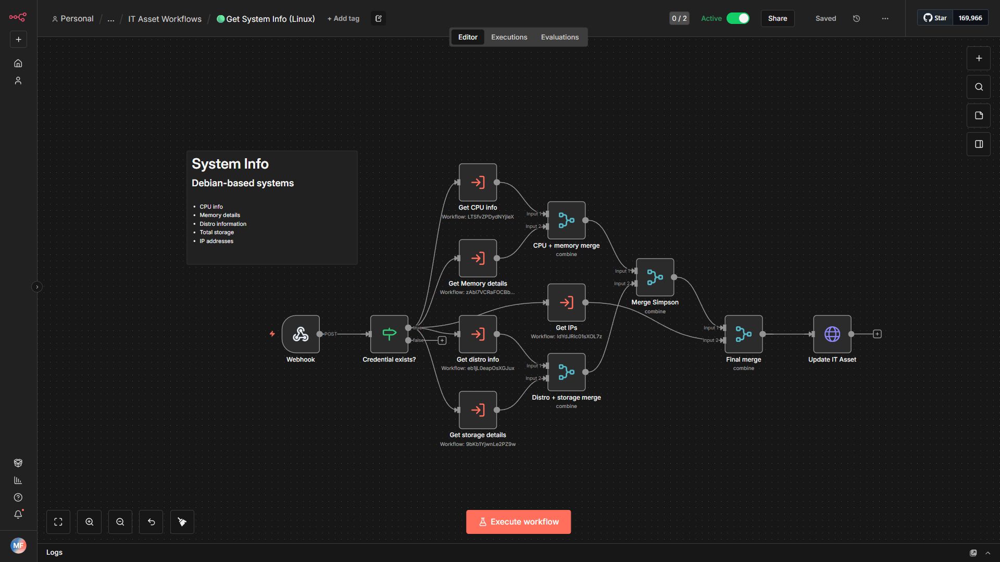
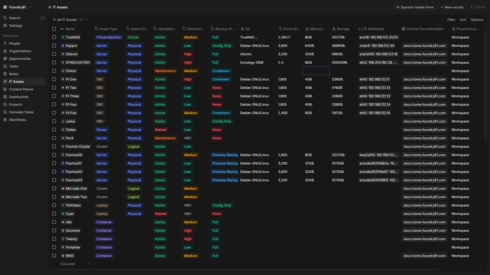

# Twenty CRM/n8n IT Asset System Info Workflows
_A collection of n8n workflows to pull system information from Linux, Synology, and TrueNAS devices._

Designed for homelab enthusiasts, IT pros, or anyone who wants to see how SSH, JSON parsing, and modular workflows can work together. Feel free to pick them apart, remix them, or use them as inspiration.

## Main Workflows
These are the “big entry points” - each is self-contained, focused on a specific platform to keep things simple and avoid messy conditionals.

| Workflow | Purpose |
| ---------|-------- |
| `🟢Get System Info (Linux).json` | Pulls system info from Debian/Ubuntu hosts |
| `🟢Get System Info (TrueNAS).json` | Pulls system info from TrueNAS systems using TrueNAS CLI |
| `🟢Get System Info (Synology).json` | Pulls system info from Synology boxes |

Each main workflow assumes SSH access with certificate-based authentication. For TrueNAS, use a read-only admin account.

## Sub-Workflows
Sub-workflows break out specific tasks - you can reuse them in multiple main workflows or as standalone experiments.

### Synology-Specific
| Workflow | Purpose |
| ---------|-------- |
| `🟣Get CPU Info (Synology).json` | Retrieves CPU info |
| `🟣Get IPs (Synology).json` | Parses IP addresses, ignores loopback, Docker, VPN, etc. |
| `🟣Get OS Version (Synology).json` | Reads /etc.defaults/VERSION and returns DSM version |
| `🟣Get Storage (Synology).json` | Lists total storage and optionally per-device storage |

### Linux (Debian/Ubuntu)
| Workflow | Purpose |
| ---------|-------- |
| `🟣Get CPU Info.json` | Pulls CPU details |
| `🟣Get IPs.json` | Uses ip -j addr for structured JSON, filters out unneeded interfaces |
| `🟣Get Memory.json` | Reads /proc/meminfo and rounds to common RAM sizes (GB) |
| `🟣Get OS Version.json` | Reads /etc/os-release to return OS name & version |
| `🟣Get Storage.json` | Uses lsblk -J to sum total storage, with optional full device info |

**Note**: Memory and storage sub-workflows have slightly different approaches for Linux vs Synology, reflecting platform differences.

## Usage Notes
### SSH Access
- Certificate-based authentication is assumed for all workflows.
- Minimal required permissions: read-only for system info, read-only admin for TrueNAS.
### **Twenty CRM Integration**
- If using these workflows in Twenty CRM, you’ll need a working instance, API URL, and API key.
- That said, the workflows are fully usable as standalone examples to learn from and adapt.
### **Learning & Exploration**
- Each workflow is modular. Pull one apart to see how SSH calls, JSON parsing, and JS nodes interact.
- The Synology workflows show how to parse less-structured outputs (/proc/partitions, /etc.defaults/VERSION).
- Linux workflows show a more structured approach using JSON outputs (ip -j addr, lsblk -J).
### **Tips**
- Ignore interfaces like `lo`, `docker`, `br-`, `veth`, `wg`, `tailscale` when parsing IPs.
- Memory rounding assumes standard retail RAM sizes: 4, 8, 16, 32, 64… GB.
- Storage parsing distinguishes between disks and partitions for clarity.

## Why This is Useful
- Learn modular workflow design without overly complex branching.
- See how to extract system info over SSH safely and reliably.
- Explore JS nodes for parsing and formatting output - easily adaptable to your own needs.
- Great starting point for home labs, monitoring scripts, or custom CRM integrations.

## Recommended Approach
1. Start with a single sub-workflow to understand its output.
2. Connect it to a main workflow to see how execution chaining works.
3. Modify JS nodes or SSH commands to suit your system or test scenarios.
4. Enjoy: each workflow is meant as a playground, not a rigid production setup.